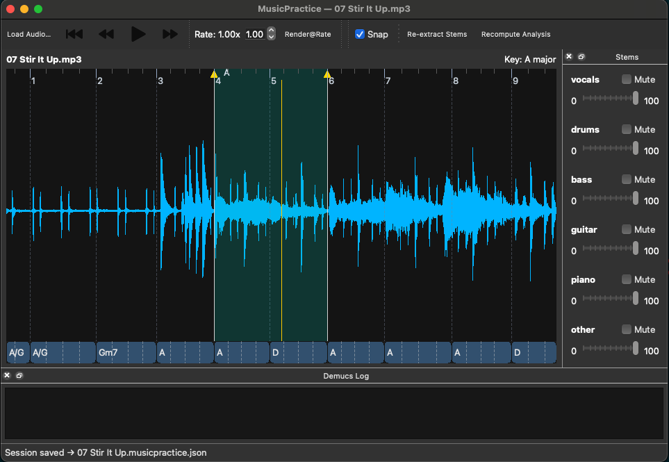
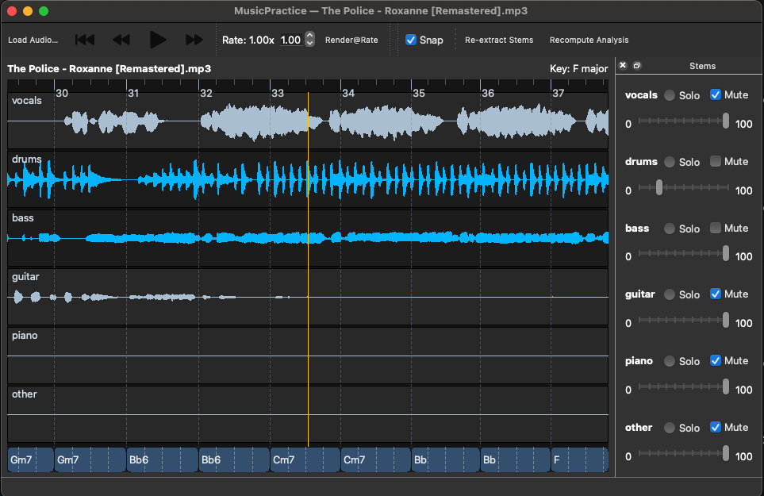

# MusicPractice

A minimal music practice application for musicians to analyze, loop, and practice with audio tracks. Features real-time audio analysis, stem separation, and interactive waveform visualization.

> **Note**: This application has primarily been tested on macOS Apple Silicon. While it should work on other platforms, some features may require additional setup or may not be fully optimized.

> **🎯 For Best Results**: We highly recommend installing the optional Vamp plugins (Chordino, qm-vamp-plugins) for significantly improved chord detection, key estimation, and beat tracking accuracy. See the "Optional Enhanced Analysis Plugins" section below for installation instructions.

## Features

- **Chord Detection**: Advanced chord recognition with optional Chordino plugin support
- **Key Detection**: Automatic key estimation with optional qm-keydetector and Chordino plugin support
- **Audio Analysis**: Beat tracking, tempo estimation, and harmonic analysis
- **Interactive Waveform**: Visual waveform with chord annotations and beat markers
- **Loop Management**: Create, save, and manage multiple loops with visual flags
- **Time Stretching**: Pitch-preserving tempo adjustment (0.5x - 1.5x)
- **Stem Separation**: AI-powered source separation using Demucs (vocals, drums, bass, etc.)
- **Session Management**: Save and restore analysis data and loop configurations
- **Cross-Platform**: Works on macOS, Windows, and Linux



## Setup

### 1. Create Virtual Environment

```bash
python -m venv .venv
source .venv/bin/activate  # Windows: .venv\Scripts\activate
pip install -r requirements.txt
```

### 2. Install System Dependencies

#### macOS (Homebrew)

```bash
brew install portaudio ffmpeg vamp-plugin-sdk libsndfile
```

#### Ubuntu/Debian

```bash
sudo apt-get update && sudo apt-get install -y python3-pip python3-venv portaudio19-dev ffmpeg
```

#### Windows

- Install [PortAudio](https://www.portaudio.com/download.html)
- Install [FFmpeg](https://ffmpeg.org/download.html) and add to PATH

## Usage

### Running from Source

```bash
python app.py
```

### Quick Launch (Recommended)

The project includes ready-to-use launchers:

#### **Command Line Launcher:**

```bash
./MusicPractice.sh
```

#### **macOS App Bundle:**

```bash
open dist/MusicPractice.app
```

Both launchers automatically activate your virtual environment and use all installed dependencies.

### Creating Standalone Application

To create a standalone application bundle that includes all dependencies:

#### 1. Install Build Dependencies

```bash
pip install -r requirements-build.txt
```

#### 2. Convert Icons (Optional)

If you need platform-specific icon formats:

```bash
python convert_icons.py
```

_Note: The project already includes icons in the `icons/` directory._

#### 3. Build Application

**Standard Build (Cross-Platform):**

```bash
python build_app.py
```

**macOS App Bundle:**

```bash
python build_app.py --macos
```

The built application will be in the `dist/` directory:

- **Windows**: `dist/MusicPractice.exe`
- **macOS**: `dist/MusicPractice.app` (if using --macos flag)
- **Linux**: `dist/MusicPractice`

#### 4. Distribution

The standalone application includes all Python dependencies and can be distributed without requiring users to install Python or any dependencies.

**Important: Vamp Plugins Highly Recommended**: While the bundled app works without Vamp plugins, **we strongly encourage installing them** for significantly improved accuracy. The built-in algorithms provide basic functionality, but Vamp plugins (Chordino, qm-vamp-plugins) offer professional-grade analysis quality that makes a substantial difference in practice sessions.

### Bundled App Behavior

The standalone application includes:

✅ **Core Features** (always available):

- Chord detection (internal algorithm)
- Key estimation (Krumhansl-Schmuckler)
- Beat tracking (Librosa-based)
- Time stretching (phase vocoder)
- Stem separation (Demucs AI)
- All UI and playback features

🎯 **Highly Recommended Enhancements** (significantly better accuracy):

- **Professional chord detection** (Chordino plugin)
- **Professional key detection** (qm-keydetector plugin)
- **Professional beat tracking** (qm-barbeattracker plugin)

**Why Install Vamp Plugins?**

- **Much more accurate** chord recognition
- **Better key detection** for complex harmonies
- **More precise beat tracking** for rhythm practice
- **Professional-grade analysis** used in music production

The app automatically detects available plugins and uses them when present, falling back to built-in algorithms when plugins are not installed.

### Basic Controls

- **Load Audio**: File → Open or drag & drop audio files (WAV, MP3, FLAC, M4A)
- **Playback**: Space bar or toolbar buttons
- **Loop Creation**:
  - Drag on waveform to create new loops
  - Click "Set A" and "Set B" buttons to set loop points
  - Right-click loop flags to rename or delete
- **Navigation**:
  - Click waveform to seek
  - Mouse wheel to zoom in/out
  - Arrow keys to pan left/right
- **Time Stretching**: Adjust rate slider (0.5x - 1.5x) for pitch-preserving tempo changes

### Keyboard Shortcuts

- **Space**: Play/Pause
- **Left/Right Arrow**: Skip to previous/next bar
- **Home**: Go to start of track
- **Ctrl+O**: Open audio file
- **Ctrl+S**: Save session
- **Ctrl+Shift+O**: Load session
- **Ctrl+Shift+R**: Recompute analysis

### Advanced Features

#### Stem Separation

- View → Combined & Show Stems
- Automatically separates audio into vocals, drums, bass, guitar, piano, and other
- Individual volume and mute controls for each stem
- Uses Demucs AI model for high-quality separation



#### Waveform View Modes

- View → Show Stem Waveforms: Display individual waveforms for each separated stem
- View → Show Combined Waveform: Display the original full mix waveform
- Toggle between views to analyze individual parts or the complete mix

#### Session Management

- File → Save Session: Saves loops, analysis data, and settings
- File → Load Session: Restores previous session state
- Sessions are automatically saved alongside audio files

#### Analysis Management

- Analysis → Recompute analysis (Ctrl+Shift+R): Force re-analysis of current track
- Analysis → Always recompute on open: Automatically clear cache and re-analyze when opening files
- Clears cached chord detection, beat tracking, and stem separation data

#### Beat Snapping

- Toggle "Snap" checkbox to snap loop edges to detected beats
- Automatic beat and bar detection with visual markers

## Technical Details

### Audio Analysis

- **Chord Detection**: Template matching with Viterbi smoothing for major/minor triads and 7th chords, with optional Chordino plugin support for improved recognition
- **Key Detection**: Krumhansl-Schmuckler key profiles with enharmonic spelling, with optional qm-keydetector and Chordino plugin support for improved estimation
- **Beat Tracking**: Librosa-based onset detection and tempo estimation, with optional qm-barbeattracker plugin support for improved accuracy
- **Time Stretching**: Librosa phase vocoder implementation preserving pitch (0.5x - 1.5x range)

### Supported Formats

- **Input**: WAV, MP3, FLAC, M4A, AAC
- **Output**: WAV (for rendered time-stretched audio)

### Dependencies

- **Core**: PySide6 (Qt), NumPy, SciPy, Librosa, SoundDevice
- **Audio Processing**: SoundFile, FFmpeg
- **AI Separation**: Demucs, PyTorch (optional, CPU works)
- **Enhanced Analysis**: Vamp Plugin SDK, nnls-chroma (Chordino), qm-vamp-plugins (optional)
- **Utilities**: TQDM for progress bars

### Optional Enhanced Analysis Plugins

For improved chord detection and key estimation, you can install these optional Vamp plugins:

#### Chordino (Chord Detection)

Chordino provides enhanced chord recognition capabilities. To install:

1. **Download Chordino**: Visit the [NNLS Chroma project page](http://isophonics.net/nnls-chroma)
2. **Install the plugin**:
   - **macOS (Intel)**: Copy `nnls-chroma.dylib` to `~/Library/Audio/Plug-Ins/Vamp/`
   - **macOS (Apple Silicon)**: Build from source as pre-built binaries are not available for ARM64
   - **Linux**: Copy `nnls-chroma.so` to `/usr/local/lib/vamp/`
   - **Windows**: Copy `nnls-chroma.dll` to your Vamp plugins directory
3. **Set permissions**: `chmod 755 ~/Library/Audio/Plug-Ins/Vamp/nnls-chroma.dylib`

**Note for Apple Silicon Macs**: The Chordino plugin must be built from source as pre-compiled ARM64 binaries are not available. Follow the build instructions in the NNLS Chroma repository. Alternatively, pre-built ARM64 binaries (`nnls-chroma.dylib`) are available in the `third-party/` directory of this project, but building from source is recommended.

#### QM Key Detector (Key Estimation)

The QM Key Detector plugin provides improved key estimation. To install:

1. **Download QM Vamp Plugins**: Visit the [QM Vamp Plugins page](https://code.soundsoftware.ac.uk/projects/qm-vamp-plugins/files)
2. **Install the plugin**:
   - **macOS (Intel)**: Copy `qm-vamp-plugins.dylib` to `~/Library/Audio/Plug-Ins/Vamp/`
   - **macOS (Apple Silicon)**: Build from source as pre-built binaries are not available for ARM64
   - **Linux**: Copy `qm-vamp-plugins.so` to `/usr/local/lib/vamp/`
   - **Windows**: Copy `qm-vamp-plugins.dll` to your Vamp plugins directory
3. **Set permissions**: `chmod 755 ~/Library/Audio/Plug-Ins/Vamp/qm-vamp-plugins.dylib`

**Note for Apple Silicon Macs**: The QM Key Detector plugin must be built from source as pre-compiled ARM64 binaries are not available. Follow the build instructions in the QM Vamp Plugins repository. Alternatively, pre-built ARM64 binaries (`qm-vamp-plugins.dylib`) are available in the `third-party/` directory of this project, but building from source is recommended.

**Note**: These plugins are automatically detected if installed. The application will fall back to built-in analysis methods if the plugins are not available.

## File Structure

```
musicpractice/
├── app.py                    # Main application and GUI with optimized waveform rendering
├── audio_engine.py           # Audio playback and time stretching
├── chords.py                 # Chord detection and key estimation with Vamp plugin support
├── stems.py                  # Stem separation with Demucs
├── timestretch.py            # Time stretching utilities
├── utils.py                  # Helper functions
├── requirements.txt          # Python dependencies
├── README.md                # This file
├── WaveformView.png         # Screenshot of main waveform interface
├── StemsView.png            # Screenshot of stem separation interface
└── third-party/             # Pre-built Vamp plugins for Apple Silicon
    ├── nnls-chroma/
    │   └── macosx-arm64/
    │       └── nnls-chroma.dylib    # Chordino chord detection plugin
    └── qm-vamp-plugins/
        └── macosx-arm64/
            └── qm-vamp-plugins.dylib # QM key detection plugin
```

## Notes

- Time-stretch renders to temporary WAV files for playback (pitch preserved)
- Chord detection uses major/minor triads and 7th chords with Viterbi smoothing
- Stem separation requires significant CPU/GPU resources and may take several minutes
- Session files are saved as `.musicpractice.json` alongside audio files
- All analysis is cached and restored when reopening files
- Use "Recompute analysis" if you need fresh analysis results or encounter issues
- Stem separation results are cached in `.musicpractice/stems/` directories
