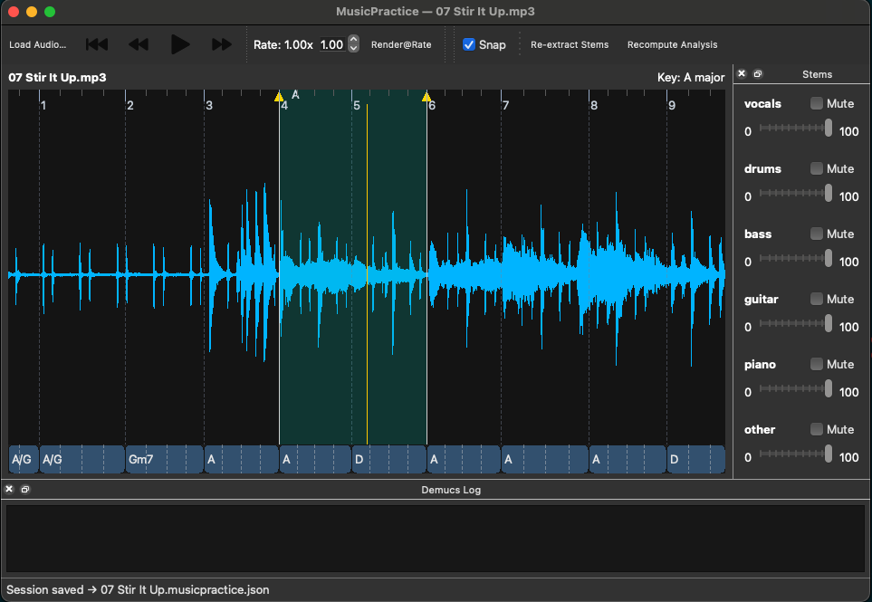
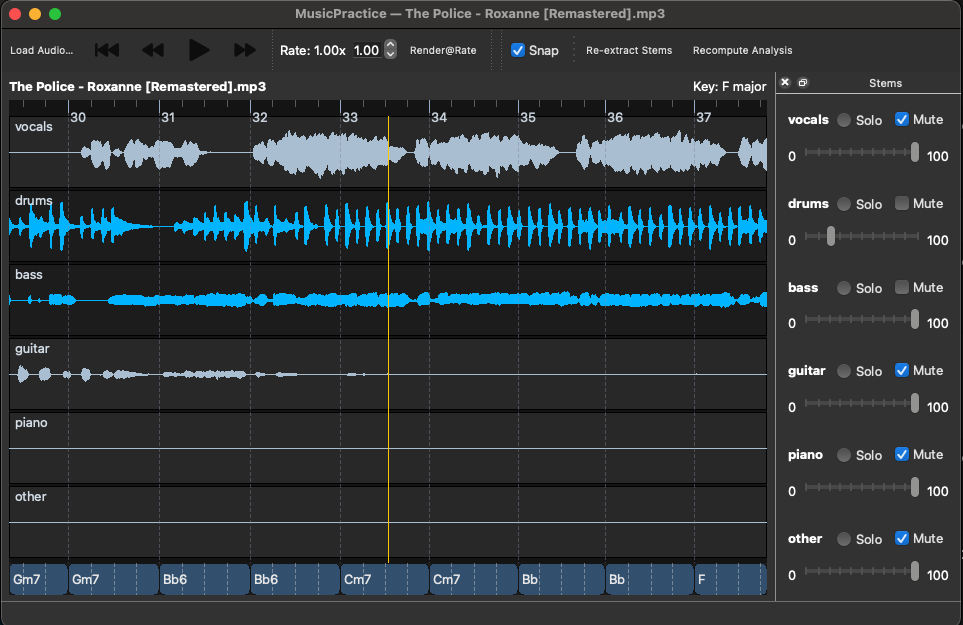
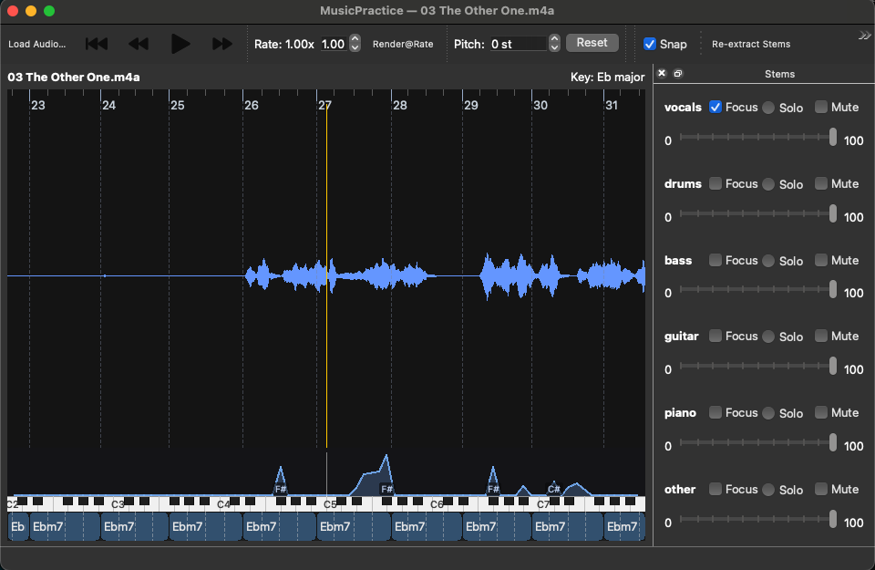

# MusicPractice

A minimal music practice application for musicians to analyze, loop, and practice with audio tracks. Features real-time audio analysis, stem separation, and interactive waveform visualization.

> **Note**: This application has primarily been tested on macOS Apple Silicon. While it should work on other platforms, some features may require additional setup or may not be fully optimized.

> **🎯 For Best Results**: We highly recommend installing the optional Vamp plugins (Chordino, qm-vamp-plugins) for significantly improved chord detection, key estimation, and beat tracking accuracy. See the "Optional Enhanced Analysis Plugins" section below for installation instructions.

## Features

- **Chord Detection**: Advanced chord recognition with optional Chordino plugin support
- **Key Detection**: Automatic key estimation with optional qm-keydetector and Chordino plugin support
- **Audio Analysis**: Beat tracking, tempo estimation, and harmonic analysis
- **Interactive Waveform**: Visual waveform with chord annotations and beat markers
- **Loop Management**: Create, save, and manage multiple loops with visual flags
- **Time Stretching**: Pitch-preserving tempo adjustment (0.5x - 1.5x)
- **Pitch Shifting**: Tempo-preserving pitch adjustment (±12 semitones) with automatic key and chord transposition
- **Stem Separation**: AI-powered source separation using Demucs (vocals, drums, bass, etc.)
- **Stem Notation Export**: Generate a hybrid standard-notation + tablature PDF from a separated stem
- **Session Management**: Save and restore analysis data and loop configurations
- **Cross-Platform**: Works on macOS, Windows, and Linux



## Setup

### 1. Create Virtual Environment

```bash
python -m venv .venv
source .venv/bin/activate  # Windows: .venv\Scripts\activate
pip install -r requirements.txt
```

### 2. Install System Dependencies

#### macOS (Homebrew)

```bash
brew install portaudio ffmpeg vamp-plugin-sdk libsndfile
```

#### Ubuntu/Debian

```bash
sudo apt-get update && sudo apt-get install -y python3-pip python3-venv portaudio19-dev ffmpeg
```

#### Windows

- Install [PortAudio](https://www.portaudio.com/download.html)
- Install [FFmpeg](https://ffmpeg.org/download.html) and add to PATH

## Usage

### Running the Application

Simply run the main application file:

```bash
python app.py
```

The application will start with all features available, including:

✅ **Core Features** (always available):

- Chord detection (internal algorithm)
- Key estimation (Krumhansl-Schmuckler)
- Beat tracking (Librosa-based)
- Time stretching (phase vocoder)
- Stem separation (Demucs AI)
- All UI and playback features

🎯 **Highly Recommended Enhancements** (significantly better accuracy):

- **Professional chord detection** (Chordino plugin)
- **Professional key detection** (qm-keydetector plugin)
- **Professional beat tracking** (qm-barbeattracker plugin)

**Why Install Vamp Plugins?**

- **Much more accurate** chord recognition
- **Better key detection** for complex harmonies
- **More precise beat tracking** for rhythm practice
- **Professional-grade analysis** used in music production

The app automatically detects available plugins and uses them when present, falling back to built-in algorithms when plugins are not installed.

### Basic Controls

- **Load Audio**: File → Open or drag & drop audio files (WAV, MP3, FLAC, M4A)
- **Playback**: Space bar or toolbar buttons
- **Loop Creation**:
  - Drag on waveform to create new loops
  - Click "Set A" and "Set B" buttons to set loop points
  - Right-click loop flags to rename or delete
- **Navigation**:
  - Click waveform to seek
  - Mouse wheel to zoom in/out
  - Arrow keys to pan left/right
- **Time Stretching**: Adjust rate slider (0.5x - 1.5x) for pitch-preserving tempo changes
- **Pitch Shifting**: Use pitch spinner (±12 semitones) for tempo-preserving pitch changes with automatic key/chord transposition

### Keyboard Shortcuts

- **Space**: Play/Pause
- **Left/Right Arrow**: Skip to previous/next bar
- **Home**: Go to start of track
- **Ctrl+O**: Open audio file
- **Ctrl+S**: Save session
- **Ctrl+Shift+O**: Load session
- **Ctrl+Shift+R**: Recompute analysis

### Advanced Features

#### Stem Separation

- View → Combined & Show Stems
- Automatically separates audio into vocals, drums, bass, guitar, piano, and other
- Individual volume and mute controls for each stem
- **Focus Button**: Click the focus button next to any stem to solo it and display a piano roll visualization
- **Show Notation Button**: Transcribe a stem to MIDI and render a combined notation + tablature PDF
- Uses Demucs AI model for high-quality separation

The notation export keeps intermediate artifacts per stem in the track's `.musicpractice/notation/<stem>/` folder:

- `*_raw.mid`: the direct Basic Pitch transcription
- `*_clean.mid`: instrument-aware cleaned MIDI used as the editable source of truth for notation
- `*_quantized.mid`: grid-snapped MIDI generated from the clean MIDI
- `*.ly` and `*.pdf`: the LilyPond source and rendered notation/tab PDF

If `clean.mid` or `quantized.mid` already exist, the app reuses them and only regenerates downstream artifacts when needed. This makes it easy to refine the clean or quantized MIDI in a DAW and reopen notation without retranscribing the audio.





#### Waveform View Modes

- View → Show Stem Waveforms: Display individual waveforms for each separated stem
- View → Show Combined Waveform: Display the original full mix waveform
- Toggle between views to analyze individual parts or the complete mix

#### Session Management

- File → Save Session: Saves loops, analysis data, and settings
- File → Load Session: Restores previous session state
- Sessions are automatically saved alongside audio files

#### Analysis Management

- Analysis → Recompute analysis (Ctrl+Shift+R): Force re-analysis of current track
- Analysis → Always recompute on open: Automatically clear cache and re-analyze when opening files
- Clears cached chord detection, beat tracking, and stem separation data

#### Beat Snapping

- Toggle "Snap" checkbox to snap loop edges to detected beats
- Automatic beat and bar detection with visual markers

#### Pitch Shifting

- **Pitch Control**: Use the pitch spinner in the toolbar to adjust pitch by ±12 semitones
- **Tempo Preservation**: Pitch changes do not affect playback speed
- **Automatic Transposition**: Key labels and chord names are automatically transposed to match the new pitch
- **Stem Processing**: All separated stems are pitch-shifted together for consistent playback
- **Caching**: Pitch-shifted audio is cached for faster loading on subsequent sessions
- **Reset Button**: Quickly return to original pitch (0 semitones) using the Reset button
- **Session Persistence**: Pitch settings are saved and restored with session data

## Technical Details

### Audio Analysis

- **Chord Detection**: Template matching with Viterbi smoothing for major/minor triads and 7th chords, with optional Chordino plugin support for improved recognition
- **Key Detection**: Krumhansl-Schmuckler key profiles with enharmonic spelling, with optional qm-keydetector and Chordino plugin support for improved estimation
- **Beat Tracking**: Librosa-based onset detection and tempo estimation, with optional qm-barbeattracker plugin support for improved accuracy
- **Time Stretching**: Librosa phase vocoder implementation preserving pitch (0.5x - 1.5x range)
- **Pitch Shifting**: Librosa pitch shifting with tempo preservation (±12 semitones range)

### Supported Formats

- **Input**: WAV, MP3, FLAC, M4A, AAC
- **Output**: WAV (for rendered time-stretched audio)

### Dependencies

- **Core**: PySide6 (Qt), NumPy, SciPy, Librosa, SoundDevice
- **Audio Processing**: SoundFile, FFmpeg
- **AI Separation**: Demucs, PyTorch (optional, CPU works)
- **Enhanced Analysis**: Vamp Plugin SDK, nnls-chroma (Chordino), qm-vamp-plugins (optional)
- **Utilities**: TQDM for progress bars

### Optional Enhanced Analysis Plugins

For improved chord detection and key estimation, you can install these optional Vamp plugins:

#### Chordino (Chord Detection)

Chordino provides enhanced chord recognition capabilities. To install:

1. **Download Chordino**: Visit the [NNLS Chroma project page](http://isophonics.net/nnls-chroma)
2. **Install the plugin**:
   - **macOS (Intel)**: Copy `nnls-chroma.dylib` to `~/Library/Audio/Plug-Ins/Vamp/`
   - **macOS (Apple Silicon)**: Build from source as pre-built binaries are not available for ARM64
   - **Linux**: Copy `nnls-chroma.so` to `/usr/local/lib/vamp/`
   - **Windows**: Copy `nnls-chroma.dll` to your Vamp plugins directory
3. **Set permissions**: `chmod 755 ~/Library/Audio/Plug-Ins/Vamp/nnls-chroma.dylib`

**Note for Apple Silicon Macs**: The Chordino plugin must be built from source as pre-compiled ARM64 binaries are not available. Follow the build instructions in the NNLS Chroma repository. Alternatively, pre-built ARM64 binaries (`nnls-chroma.dylib`) are available in the `third-party/` directory of this project, but building from source is recommended.

#### QM Key Detector (Key Estimation)

The QM Key Detector plugin provides improved key estimation. To install:

1. **Download QM Vamp Plugins**: Visit the [QM Vamp Plugins page](https://code.soundsoftware.ac.uk/projects/qm-vamp-plugins/files)
2. **Install the plugin**:
   - **macOS (Intel)**: Copy `qm-vamp-plugins.dylib` to `~/Library/Audio/Plug-Ins/Vamp/`
   - **macOS (Apple Silicon)**: Build from source as pre-built binaries are not available for ARM64
   - **Linux**: Copy `qm-vamp-plugins.so` to `/usr/local/lib/vamp/`
   - **Windows**: Copy `qm-vamp-plugins.dll` to your Vamp plugins directory
3. **Set permissions**: `chmod 755 ~/Library/Audio/Plug-Ins/Vamp/qm-vamp-plugins.dylib`

**Note for Apple Silicon Macs**: The QM Key Detector plugin must be built from source as pre-compiled ARM64 binaries are not available. Follow the build instructions in the QM Vamp Plugins repository. Alternatively, pre-built ARM64 binaries (`qm-vamp-plugins.dylib`) are available in the `third-party/` directory of this project, but building from source is recommended.

**Note**: These plugins are automatically detected if installed. The application will fall back to built-in analysis methods if the plugins are not available.

### Optional Notation Dependencies

The stem notation export is effectively a second Python toolchain inside this repo:

- The main MusicPractice app runs in the normal project environment from `requirements.txt`
- The notation/transcription helper runs in its own `.venv-basic-pitch` environment

The notation helper environment is separate on purpose so the Basic Pitch stack and MIDI tooling do not have to be installed into the main app environment.

The stem notation export feature depends on:

- **Spotify Basic Pitch** in a separate helper environment for audio-to-MIDI transcription:
  `python3.11 -m venv .venv-basic-pitch && .venv-basic-pitch/bin/pip install -r requirements-basic-pitch.txt`
- **LilyPond** for rendering the final standard-notation + tablature PDF

The app looks for the helper interpreter at `.venv-basic-pitch/bin/python` by default.
If you keep it somewhere else, set `BASIC_PITCH_PYTHON` before launching the app.
The app will show a dependency message instead of failing if either tool is missing.

### Notation Pipeline Notes

- Bass stems get additional pre-quantization cleanup to suppress ghost notes and out-of-register artifacts.
- Bass tablature uses phrase-aware fingering heuristics so the tab can favor more realistic string choices instead of only the lowest-fret spelling of each pitch.
- The notation cache is incremental: newer `clean.mid` regenerates `quantized.mid`, `.ly`, and `.pdf`; newer `quantized.mid` regenerates `.ly` and `.pdf`.

## File Structure

```
musicpractice/
├── app.py                    # Main application and GUI with optimized waveform rendering
├── audio_engine.py           # Audio playback and time stretching
├── chords.py                 # Chord detection and key estimation with Vamp plugin support
├── stems.py                  # Stem separation with Demucs
├── timestretch.py            # Time stretching utilities
├── utils.py                  # Helper functions
├── requirements.txt          # Python dependencies
├── README.md                # This file
├── WaveformView.png         # Screenshot of main waveform interface
├── StemsView.png            # Screenshot of stem separation interface
└── third-party/             # Pre-built Vamp plugins for Apple Silicon
    ├── nnls-chroma/
    │   └── macosx-arm64/
    │       └── nnls-chroma.dylib    # Chordino chord detection plugin
    └── qm-vamp-plugins/
        └── macosx-arm64/
            └── qm-vamp-plugins.dylib # QM key detection plugin
```

## Notes

- Time-stretch renders to temporary WAV files for playback (pitch preserved)
- Pitch-shifted audio is cached in `pitch+N/` subdirectories for faster subsequent loading
- Chord detection uses major/minor triads and 7th chords with Viterbi smoothing
- Stem separation requires significant CPU/GPU resources and may take several minutes
- Session files are saved as `.musicpractice.json` alongside audio files
- All analysis is cached and restored when reopening files
- Use "Recompute analysis" if you need fresh analysis results or encounter issues
- Stem separation results are cached in `.musicpractice/stems/` directories
